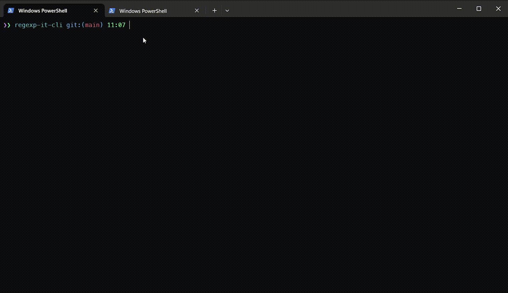
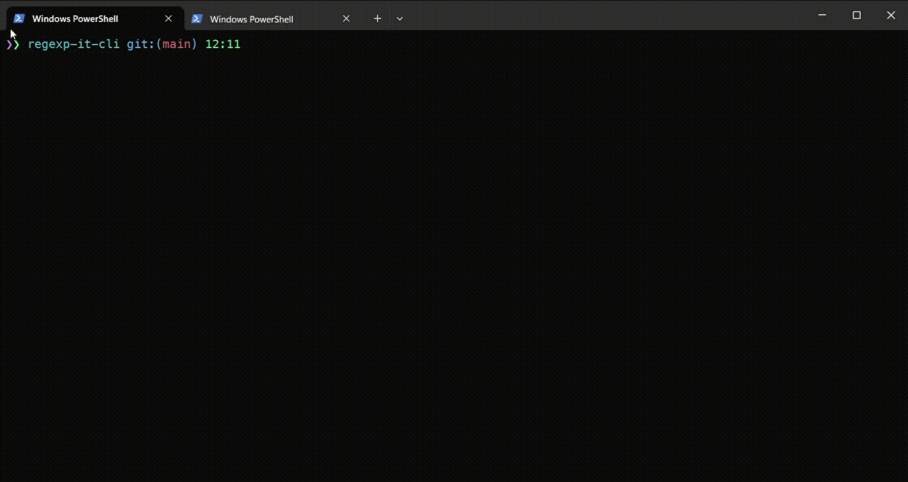
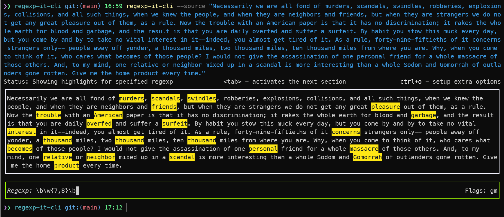
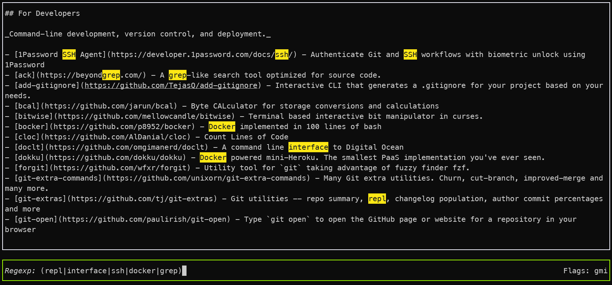
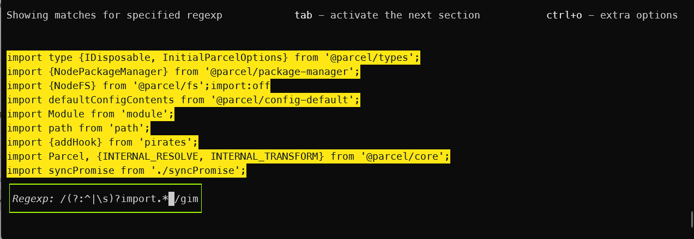
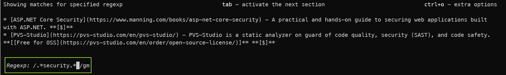
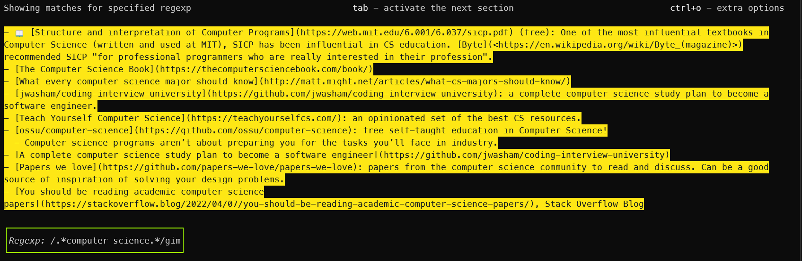
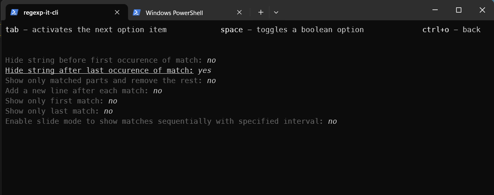

# regexp-it-cli [![NPM version][npm-image]][npm-url]

> Command line application to search text by regular expressions

## Install

```bash
$ npm install --global regexp-it-cli
```

## CLI

```
$ regexp-it-cli --help

Command line application to search text by regular expressions with plenty of features

Usage
	$ regexp-it-cli

Options
	--source, -s                     Optional source string (can be typed through terminal ui after launching)
	--file, -f                       Optional file which content's should be used as a source
	--url, -u                        Optional url where extract data from which content's should be used as a source
	--regexp, -r                     Optional regexp string (can be typed through terminal ui after launching)
	--regexp-pattern, -p             Use available predefined named pattern as a regexp str
	--quit, -q                       Show matched parts and quit without running interactive ui
	--only-matched-parts, -m         Activate only matched parts option (remove not matched parts from a source)
	--new-line-after-each-match, -n  Add a new line after each match in a source
	--show-borders, -b               Whether to use borders
	--highlight, -h                  Use colors to highligh matched parts
	--slide-mode, -l                 Show all matches in slide mode one after one with specified interval
	--slide-delay, -e                The timer delay in slide mode (in seconds)
	--only-first-match, -i           Show only first match
	--only-last-match, -t            Show only last match
	--after-regexp, -a               Show only matches suceeding specified regex match
	--before-regexp, -o              Show only matches preceding specified regex match
	--starting-line-number           Starting line from a source to be used
	--ending-line-number             Ending line from a source to be used


Examples
	$ regexp-it-cli
	$ regexp-it-cli --source "My text which
is going to be used for regexp expectations"
	$ regexp-it-cli  --source "My sample text
as a source for regexp expectations" --regexp-str "t[a-t]"
	$ regexp-it-cli --file "content.txt" --regexp-str "([Tt]he|a) \w{4,6}\b"
	$ regexp-it-cli --file current.log --regexp-pattern info
	$ regexp-it-cli --file current.log --regexp-pattern error -h f
	$ regexp-it-cli --file server.log --regexp-pattern debug --slide-mode
	$ regexp-it-cli --file file.txt --regexp-pattern url --slide-mode
	$ rgi --file README.md --regexp-pattern url --highlight false
	$ rgi --file README.md --regexp-pattern urlWoP  --slide-mode --only-matched-parts
	$ rgi --file README.md --starting-line-number 6 --regexp-pattern url --only-matched-parts
	$ rgi --file README.md --sln 6 --regexp-pattern url --only-matched-parts
	$ rgi --file README.md --starting-line-number 6 --ending-line-number 15 --regexp-pattern url
	$ rgi --file README.md --sln 6 --eln 15 --regexp-pattern url
	$ rgi --file example.txt --regexp-pattern mention --only-first-match
	$ rgi --file someFile.txt --regexp-pattern articlePlusWord --e
	$ rgi --file index.js --regexp-pattern import -m -e
	$ rgi --file index.js --regexp-pattern import --only-first-match --exit
	$ rgi --file app.log --regexp-pattern error --only-last-match
```

## Demos, Use case

### Basic demo


### Using predefined patterns


### Filtering content between sections


### Get matches from url source


### Display matches in slide mode


### Find repos belonging to specific user


### Displaying first and last match



### Hiding lines before and after match


### Specifying starting/ending line from a source to be used as a content

```bash
$ regexp-it-cli --file "samples/awesome-react.md" --regexp ".*lightweight.*" -e -m -q --starting-line-number 130
$ regexp-it-cli --file "samples/awesome-react.md" --regexp ".*lightweight.*" -e -m -q --starting-line-number 130 --ending-line-number 155
$ regexp-it-cli --file "samples/awesome-react.md" --regexp ".*lightweight.*" -e -m -q --sln 130 --eln 155
$ regexp-it-cli --file "samples/awesome-react.md" --regexp ".*lightweight.*" -e -m -q --ending-line-number 155
```

See [](samples/awesome-react.md) that was used as a source file



## Screenshots

Example with a source using `\b\w{7,8}\b` regular expression


Example with a file source


Example using a predefined pattern import using the following options: `--regexp-pattern import --only-matched-parts`


Example using the `.*security.*` regexp with --only-matched-parts`and`--highlight false` options for [awesome-dotnet's Readme file](https://github.com/quozd/awesome-dotnet) as a source (see full markdown file content [in raw mode](https://raw.githubusercontent.com/quozd/awesome-dotnet/master/README.md))


Example using the `.*computer science.*` regexp and --only-matched-parts option for example md file as a source (you can show full markdown file content [in here](https://github.com/charlax/professional-programming) or [in raw mode](https://raw.githubusercontent.com/charlax/professional-programming/master/README.md))


Setup neccessary options by opening menu by using Ctrl+O key combination


## License

MIT © [Rushan Alyautdinov](https://github.com/akgondber)

[npm-image]: https://img.shields.io/npm/v/regexp-it-cli.svg?style=flat
[npm-url]: https://npmjs.org/package/regexp-it-cli
